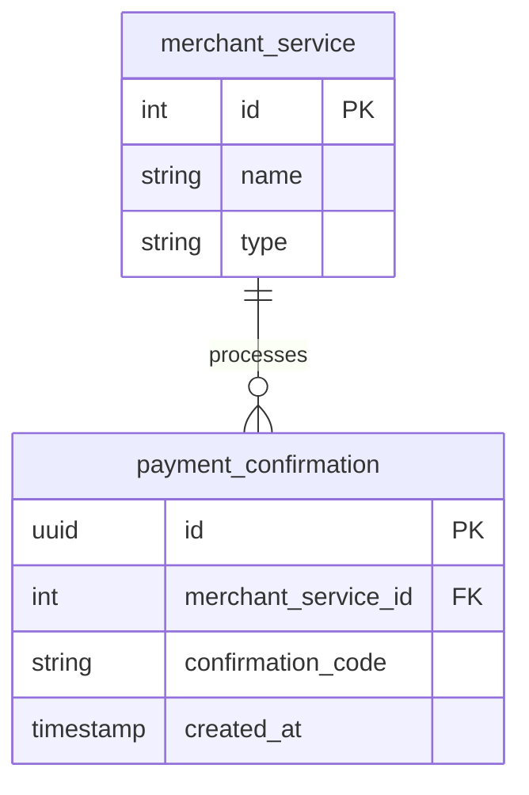

# Payment Database

The `paymentdb` database stores payment confirmations and merchant service configurations.

## Schema

## Tables

### `merchant_service`

Payment provider configurations (e.g., Stripe). Used to track which service processed a payment.

### `payment_confirmation`

Records of completed payments. Links to merchant service and stores the external confirmation code. Referenced by `plan_subscription` in productdb.
