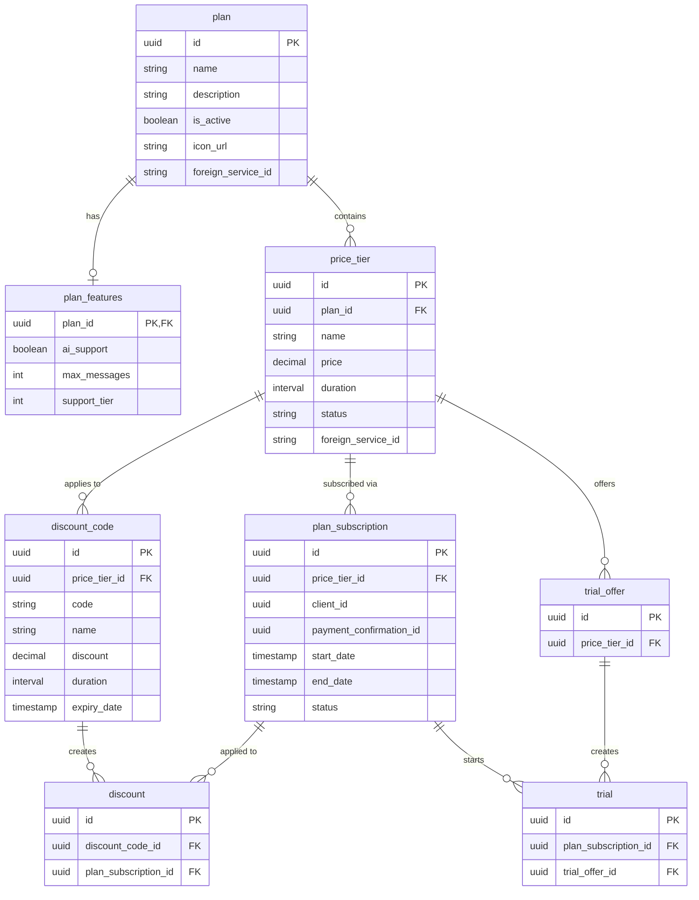

# Product Database

The `productdb` database stores subscription plans, pricing, and related entities.

## Schema

## Tables

### `plan`

Base entity for subscription products. Each plan has features and one or more price tiers.

### `plan_features`

Features included with a plan (AI support, message limits, support tier). One-to-one with plan.

### `price_tier`

Pricing options for a plan. A plan may have multiple tiers (e.g., monthly, yearly) with different prices and durations.

### `plan_subscription`

Records a client's subscription to a specific price tier, with start/end dates and payment confirmation reference.

### `discount_code`

Promotional codes that can be applied to subscriptions for a discount percentage and duration.

### `trial_offer` / `trial`

Trial period offerings and active trials for subscriptions.
