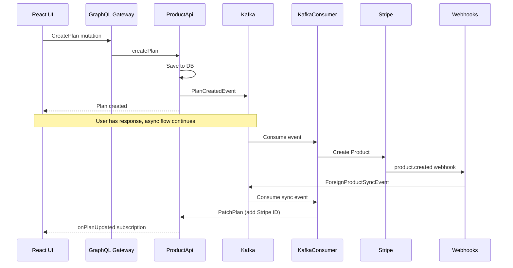

# Getting Started

This guide walks you through setting up and running the Nudges system locally.

## Prerequisites

- [Docker](https://www.docker.com/) and Docker Compose
- [.NET SDK](https://dotnet.microsoft.com/download) (for dev-certs)
- [Stripe](https://stripe.com/) account (free)
- [ngrok](https://ngrok.com/) account (free)
- PowerShell

## 1. Add Hosts Entry

Keycloak requires a consistent hostname for OIDC token validation. Add this to your hosts file:

=== "Windows"

    Edit `C:\Windows\System32\drivers\etc\hosts` as Administrator:
    ```
    127.0.0.1    keycloak.local
    ```

=== "macOS / Linux"

    ```bash
    sudo sh -c 'echo "127.0.0.1    keycloak.local" >> /etc/hosts'
    ```

## 2. Setup ngrok

1. Create an ngrok account and follow their [setup instructions](https://ngrok.com/docs/getting-started)
2. Create `ngrok/ngrok.yml`:

```yaml
version: "2"
authtoken: <your_auth_token>

tunnels:
  webhooks:
    proto: http
    addr: host.docker.internal:7071
    domain: <your_domain>
```

Replace `<your_auth_token>` and `<your_domain>` with your ngrok credentials.

## 3. Setup Stripe Webhooks

1. In the Stripe Dashboard, go to **Developers > Webhooks**
2. Add a new endpoint:
   - **URL**: `https://<your_domain>/api/StripeWebhookHandler?code=<your_api_key>`
   - **Events**: `product.created`
3. Copy the **Signing secret** (you'll need it below)

## 4. Configure Environment

Create `.env.external` at the repository root:

```ini
STRIPE_API_KEY=<your_stripe_api_key>
STRIPE_WEBHOOKS_SECRET=<your_signing_secret>
WEBHOOKS_API_KEY=<your_api_key>  # must match the ?code= in webhook URL

# Optional (not needed for demo)
TWILIO_ACCOUNT_SID=xxx
TWILIO_AUTH_TOKEN=xxx
TWILIO_MESSAGE_SERVICE_SID=xxx
```

| Variable | Source |
|----------|--------|
| `STRIPE_API_KEY` | Stripe Dashboard > Developers > API keys |
| `STRIPE_WEBHOOKS_SECRET` | Generated when creating the webhook endpoint |
| `WEBHOOKS_API_KEY` | Any value you choose (must match URL above) |

## 5. Generate Certificates

```powershell
# Create the PFX certificate
dotnet dev-certs https -ep ./certs/aspnetapp.pfx

# Generate PEM files for nginx
./certs/generate-certs.ps1
```

## 6. Start the System

```powershell
./start-dev.ps1
```

First run takes ~20 minutes to build all containers. Once ready, open `https://localhost:5050`.

**Login credentials:**

- Username: `+15555555555`
- Password: `pass`

If you see a "View Plans" button, the system is running.

## Creating Your First Plan

1. Log in with the credentials above
2. Click **View Plans** > **Create Plan**
3. Enter a **Name** and **Max Messages** (minimum required fields)
4. Save changes

If the "Foreign Service ID" field updates automatically, the full event-driven flow is working:



## Troubleshooting

### Services won't start

- Check Docker is running
- Verify `.env.external` exists with valid values
- Check terminal output for specific errors

### Foreign Service ID doesn't update

- Verify ngrok is running and tunnel is active
- Check Stripe webhook endpoint is configured correctly
- Ensure `WEBHOOKS_API_KEY` matches the `?code=` parameter in webhook URL

### Certificate errors

- Re-run `dotnet dev-certs https -ep ./certs/aspnetapp.pfx`
- Re-run `./certs/generate-certs.ps1`
- Trust the dev certificate: `dotnet dev-certs https --trust`
