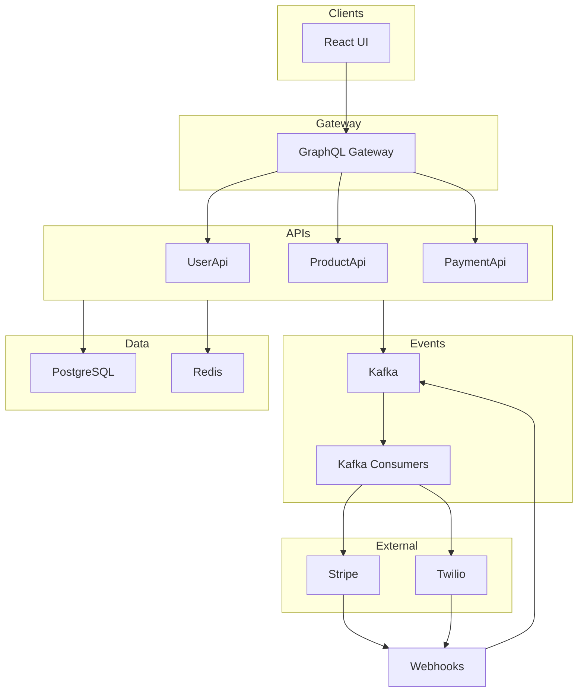
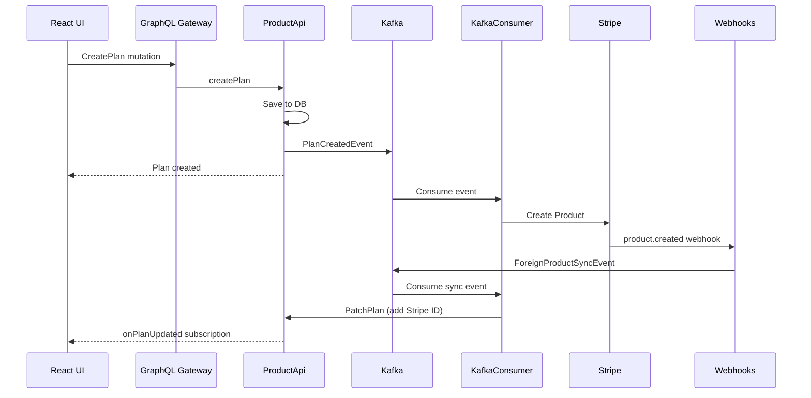

# Nudges

Nudges is a **demo implementation of a paid SMS relay platform**. It allows businesses ("clients") to send SMS announcements to their subscribers, with subscription management and payment processing via Stripe.

This repository serves as a proof-of-concept demonstrating a modern, event-driven microservices architecture using .NET, GraphQL, Kafka, and React.

[:fontawesome-brands-github: View on GitHub](https://github.com/getnudges/monov4){ .md-button }

## Quick Start

### Prerequisites

- [Docker](https://www.docker.com/) and Docker Compose
- [.NET SDK](https://dotnet.microsoft.com/download) (for dev-certs)
- [Stripe](https://stripe.com/) account (free)
- [ngrok](https://ngrok.com/) account (free)
- PowerShell

### 1. Setup ngrok

Create `ngrok/ngrok.yml`:

```yaml
version: "2"
authtoken: <your_auth_token>

tunnels:
  webhooks:
    proto: http
    addr: host.docker.internal:7071
    domain: <your_domain>
```

### 2. Setup Stripe Webhooks

In Stripe Dashboard > Developers > Webhooks, add endpoint:

- **URL**: `https://<your_domain>/api/StripeWebhookHandler?code=<your_api_key>`
- **Events**: `product.created`
- Copy the **Signing secret**

### 3. Configure Environment

Create `.env.external` at repo root:

```ini
STRIPE_API_KEY=<your_stripe_api_key>
STRIPE_WEBHOOKS_SECRET=<your_signing_secret>
WEBHOOKS_API_KEY=<your_api_key>  # must match URL above

# Optional (not needed for demo)
TWILIO_ACCOUNT_SID=xxx
TWILIO_AUTH_TOKEN=xxx
TWILIO_MESSAGE_SERVICE_SID=xxx
```

### 4. Start the System

```powershell
# Generate certificates
dotnet dev-certs https -ep ./certs/aspnetapp.pfx
./certs/generate-certs.ps1

# Start all services
./start-dev.ps1
```

First run takes ~20 minutes to build. Once ready, open `https://localhost:5050`.

**Login**: `+15555555555` / `pass`

## Architecture Overview



## How It Works

When a user creates a plan in the UI:



## Repository Structure

| Directory | Contents |
|-----------|----------|
| `dotnet/` | All .NET services and libraries |
| `web/` | React applications (admin UI, signup) |
| `db/` | Database scripts and migrations |
| `terraform/` | AWS infrastructure as code |
| `mkdocs/` | This documentation |
| `.github/` | CI/CD workflows |

## Key Technologies

- **Backend**: .NET 10, ASP.NET Core, HotChocolate (GraphQL)
- **Frontend**: React, Relay, TypeScript
- **Messaging**: Apache Kafka
- **Database**: PostgreSQL, Redis
- **Auth**: Keycloak (OIDC/OAuth2)
- **Payments**: Stripe
- **SMS**: Twilio
- **Infrastructure**: AWS (ECS, RDS, ElastiCache), Terraform
