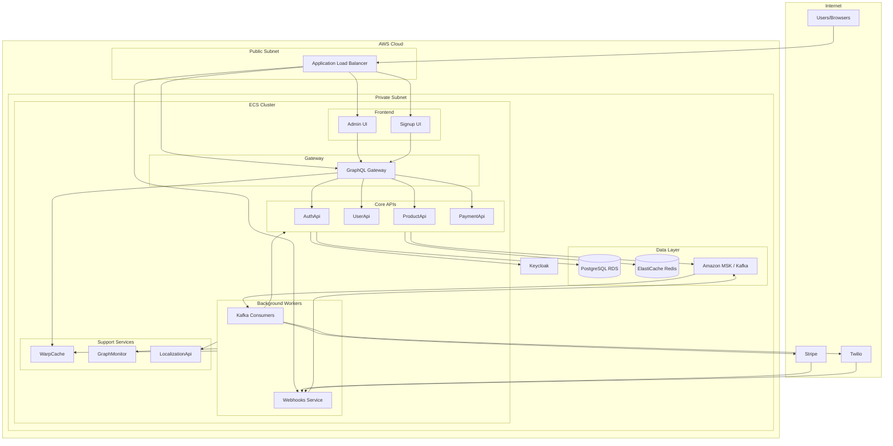
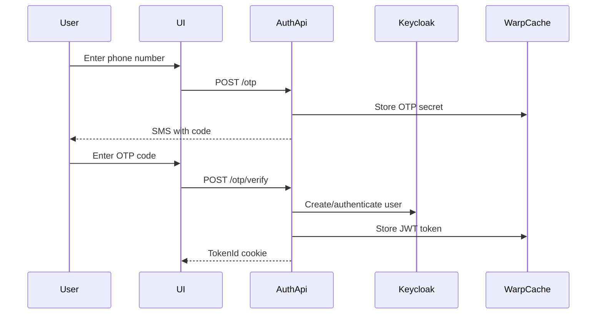
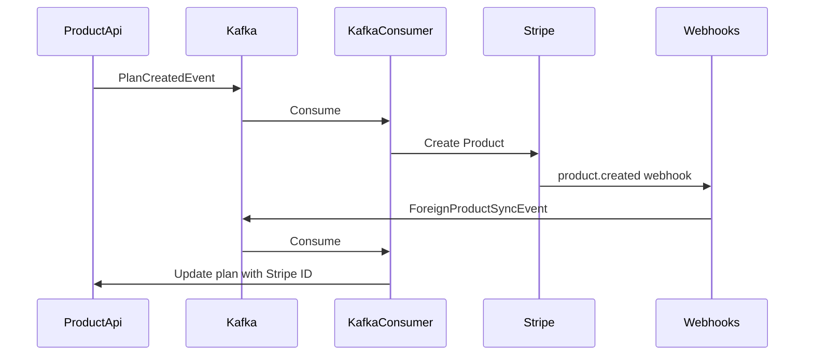
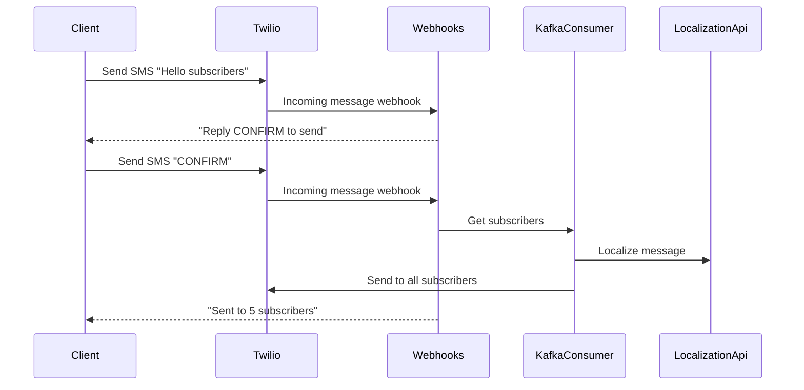

# Infrastructure Overview

Nudges is built as an event-driven microservices platform. This page provides a high-level view of how the components fit together.

## System Architecture

## Component Layers

### Client Layer

| Component | Purpose |
|-----------|---------|
| **Admin UI** | React app for clients to manage plans, view subscribers |
| **Signup UI** | React app for subscribers to sign up and manage subscriptions |

### API Layer

| Component | Purpose |
|-----------|---------|
| **GraphQL Gateway** | Federation gateway composing all GraphQL subgraphs |
| **AuthApi** | OTP and OAuth authentication, token management |
| **UserApi** | User, client, and subscriber management |
| **ProductApi** | Plans, pricing tiers, subscriptions, discounts |
| **PaymentApi** | Stripe checkout sessions, payment confirmations |

### Event Layer

| Component | Purpose |
|-----------|---------|
| **Kafka (MSK)** | Event streaming backbone |
| **KafkaConsumer** | Processes domain events, integrates with Stripe/Twilio |
| **Webhooks** | Receives external webhooks from Stripe and Twilio |

### Support Layer

| Component | Purpose |
|-----------|---------|
| **WarpCache** | High-performance gRPC caching (tokens, sessions) |
| **GraphMonitor** | GraphQL schema/endpoint registry |
| **LocalizationApi** | String translation for SMS messages |
| **Keycloak** | Identity provider (OIDC/OAuth2) |

### Data Layer

| Component | Purpose |
|-----------|---------|
| **PostgreSQL (RDS)** | Primary data store (userdb, productdb, paymentdb) |
| **Redis (ElastiCache)** | Caching, GraphQL subscriptions |

## Data Flow Patterns

### Authentication Flow

### Event-Driven Integration

### SMS Announcement Flow

## Deployment

All services run as containers in **AWS ECS** (Fargate), with:

- **Application Load Balancer** for HTTP/HTTPS traffic
- **Amazon MSK** for managed Kafka
- **Amazon RDS** for PostgreSQL
- **Amazon ElastiCache** for Redis
- **S3** for static site hosting and Terraform state
- **Route 53** for DNS
- **ACM** for SSL certificates
