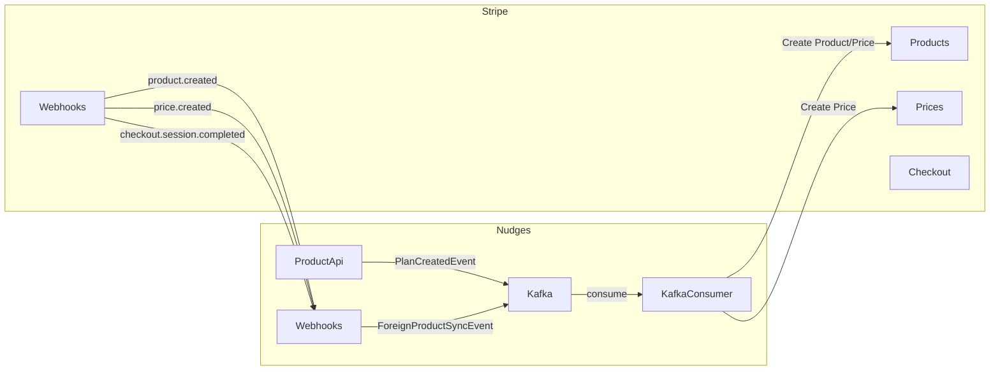
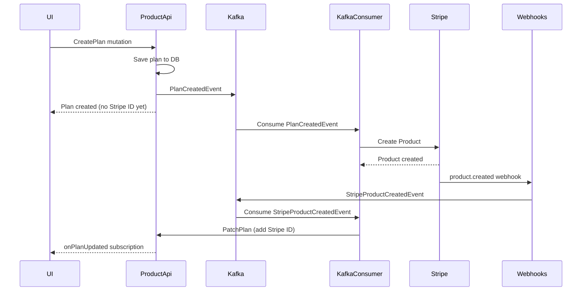

# Stripe Integration

Nudges uses Stripe for payment processing and product/pricing management. The integration is bidirectional: Nudges creates products in Stripe, and Stripe webhooks sync data back.

## Data Flow



## Outbound: Nudges → Stripe

Handled by **KafkaConsumer** (`StripeService`).

### Plan → Product Sync

When a plan is created in Nudges:

| Event | Stripe Action |
|-------|---------------|
| `PlanCreatedEvent` | Creates Stripe Product |
| `PlanUpdatedEvent` | Updates Stripe Product |

### Price Tier → Price Sync

| Event | Stripe Action |
|-------|---------------|
| `PriceTierCreatedEvent` | Creates Stripe Price |
| `PriceTierDeletedEvent` | Archives Stripe Price |

### Client → Customer Sync

| Event | Stripe Action |
|-------|---------------|
| `ClientCreatedEvent` | Creates Stripe Customer |

## Inbound: Stripe → Nudges

Handled by **Webhooks** service at `/api/StripeWebhookHandler`.

### Product Events

| Stripe Event | Nudges Action |
|--------------|---------------|
| `product.created` | Publishes `ForeignProductSyncEvent` to link Stripe ID |
| `product.updated` | Updates plan name, description, icon, active status |
| `product.deleted` | Deletes corresponding plan |

### Price Events

| Stripe Event | Nudges Action |
|--------------|---------------|
| `price.created` | Creates price tier from Stripe price |
| `price.updated` | Updates price tier amount |
| `price.deleted` | Deletes price tier |

### Checkout Events

| Stripe Event | Nudges Action |
|--------------|---------------|
| `checkout.session.completed` | Creates payment confirmation and plan subscription |

## Complete Flow Example

Creating a plan end-to-end:



## Configuration

### Webhooks Service

```ini
STRIPE_API_KEY=sk_...
STRIPE_WEBHOOKS_SECRET=whsec_...
WEBHOOKS_API_KEY=<your-key>
```

### KafkaConsumer

```ini
STRIPE_API_KEY=sk_...
STRIPE_API_URL=https://api.stripe.com
```

## Webhook Setup

### Production

1. Go to Stripe Dashboard → Developers → Webhooks
2. Add endpoint: `https://<your-domain>/api/StripeWebhookHandler?code=<WEBHOOKS_API_KEY>`
3. Select events:
   - `product.created`, `product.updated`, `product.deleted`
   - `price.created`, `price.updated`, `price.deleted`
   - `checkout.session.completed`
4. Copy the signing secret to `STRIPE_WEBHOOKS_SECRET`

### Local Development

Use ngrok to expose your local webhook endpoint:

```yaml
# ngrok/ngrok.yml
tunnels:
  webhooks:
    proto: http
    addr: host.docker.internal:7071
    domain: <your-ngrok-domain>
```

Or use the Stripe CLI:

```bash
stripe listen --forward-to localhost:7071/api/StripeWebhookHandler?code=your-key
```

## Entity Mapping

| Nudges | Stripe |
|--------|--------|
| Plan | Product |
| PriceTier | Price |
| Client | Customer |
| PlanSubscription | Subscription |
| PaymentConfirmation | Checkout Session |

## Error Handling

The KafkaConsumer uses Polly for resilience:

- **Retry**: 3 attempts with exponential backoff for transient Stripe API failures
- **Circuit Breaker**: Opens after 5 consecutive failures, preventing cascade failures
