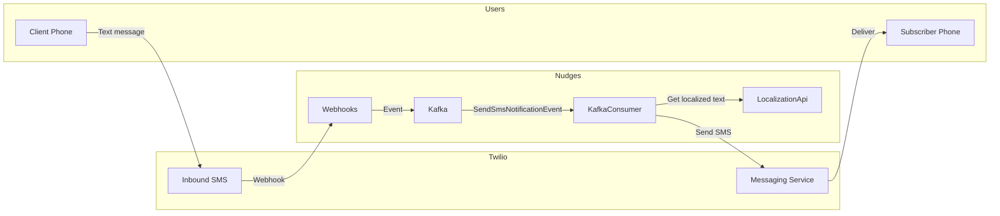
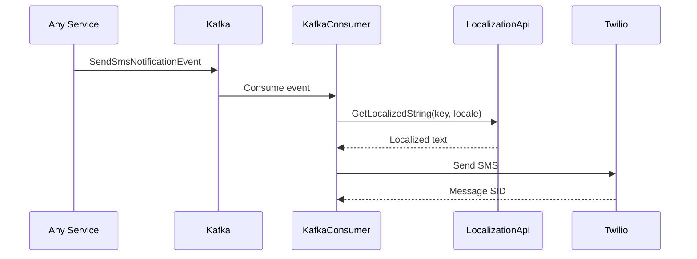
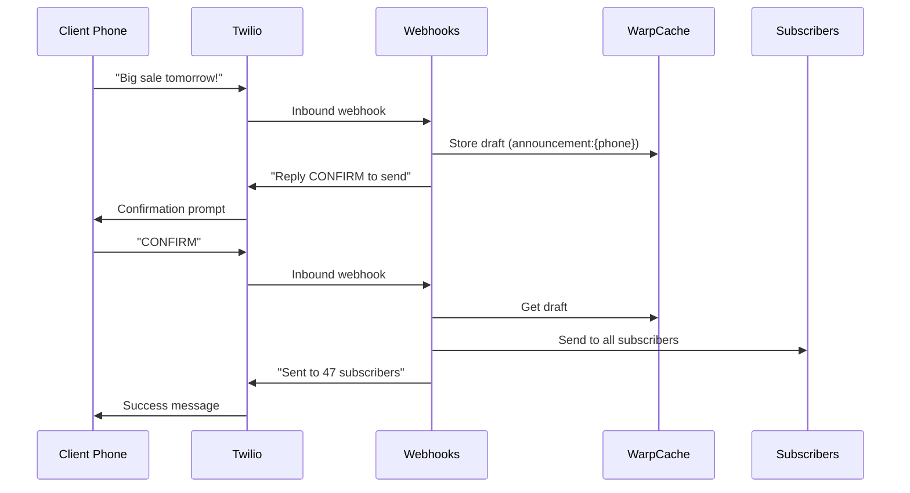

# Twilio Integration

Nudges uses Twilio for SMS messaging. The integration handles both outbound notifications (sending SMS to subscribers) and inbound messages (receiving commands via SMS).

## Data Flow



## Outbound: Nudges → Twilio

Handled by **KafkaConsumer** (`TwilioNotifier`).

### Notification Events

| Event | Action |
|-------|--------|
| `SendSmsNotificationEvent` | Localizes message, sends via Twilio |

### Notification Flow



### Triggered Notifications

| Trigger | Message |
|---------|---------|
| User login | Login confirmation SMS |
| Client created | Welcome SMS |
| Plan subscription created | Subscription confirmation |
| Announcement sent | Broadcast to all subscribers |

## Inbound: Twilio → Nudges

Handled by **Webhooks** service at `/api/TwilioWebhookHandler`.

### SMS Commands

Users can text commands to interact with the system:

| Command | Pattern | Action |
|---------|---------|--------|
| `COMMANDS` | `^commands$` | Returns help text with links |
| `HELP` | `^help$` | Returns help text with links |
| `UNSUB <n>` | `UNSUB (\d+)` | Unsubscribe from client by number |
| `CONFIRM` | `^CONFIRM$` | Confirms pending announcement |
| *(any text)* | `.*` | Drafts announcement (clients only) |

### Announcement Flow

Clients can send announcements via SMS:



### Ignored Keywords

Twilio's standard opt-in/opt-out keywords are acknowledged but not processed:

- `STOP` - Opt out (handled by Twilio)
- `START` - Opt back in (handled by Twilio)
- `UNSTOP` - Opt back in (handled by Twilio)
- `HELP` - Processed as command

## Configuration

### Webhooks Service

```ini
TWILIO_ACCOUNT_SID=AC...
TWILIO_AUTH_TOKEN=<token>
TWILIO_MESSAGE_SERVICE_SID=MG...
WEBHOOKS_API_KEY=<your-key>

# URLs included in SMS responses
AccountUrl=https://app.example.com/account
ClientLinkBaseUri=https://app.example.com
```

### KafkaConsumer

```ini
TWILIO_ACCOUNT_SID=AC...
TWILIO_AUTH_TOKEN=<token>
TWILIO_MESSAGE_SERVICE_SID=MG...
LOCALIZATION_API_URL=http://localization-api:8888
```

## Webhook Setup

Configure Twilio to send inbound SMS to your webhook:

1. Go to Twilio Console → Messaging → Services
2. Select your Messaging Service
3. Under "Integration", set webhook URL:
   - `https://<your-domain>/api/TwilioWebhookHandler?code=<WEBHOOKS_API_KEY>`

### Local Development

Use ngrok to expose your local webhook endpoint:

```yaml
# ngrok/ngrok.yml
tunnels:
  webhooks:
    proto: http
    addr: host.docker.internal:7071
    domain: <your-ngrok-domain>
```

## Development Mode

In development, the KafkaConsumer uses `LocalNotifier` instead of `TwilioNotifier`. SMS messages are logged to the console rather than sent via Twilio.

```
[INF] SMS to +15551234567: Welcome to Nudges! Your account is ready.
```

This allows testing the full notification flow without Twilio credentials or charges.

## Localization

All SMS messages are localized via the LocalizationApi:

| Resource Key | en-US | es-ES |
|--------------|-------|-------|
| `WelcomeMessage` | "Welcome to Nudges!" | "¡Bienvenido a Nudges!" |
| `AnnouncementSent` | "Sent to {count} subscribers" | "Enviado a {count} suscriptores" |
| `ClientHelpMessage` | "Reply COMMANDS for help" | "Responde COMMANDS para ayuda" |

The user's locale is stored in `userdb.user.locale` and passed with each notification event.
