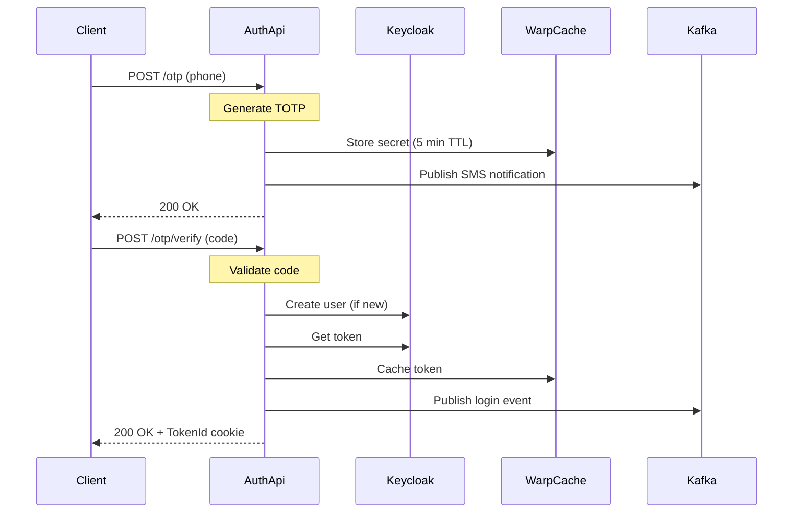
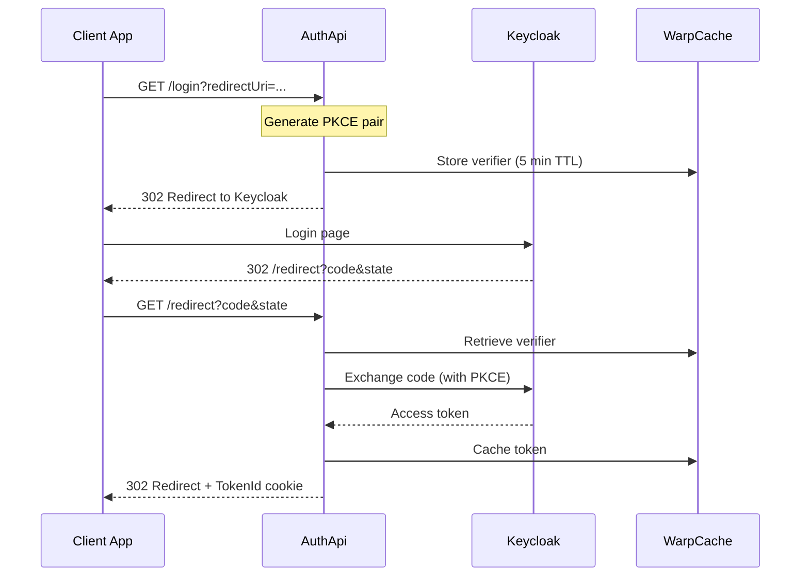

# AuthApi

The **AuthApi** is the primary authentication and authorization gateway for the Nudges platform. It handles OTP-based phone authentication, OAuth 2.0/OIDC integration with Keycloak, user provisioning, and token management.

## Overview

Key responsibilities:

- **OTP Authentication** - Generate and validate one-time passwords for phone-based verification
- **OAuth 2.0/OIDC** - Handle authorization code flow with PKCE via Keycloak
- **User Provisioning** - Automatically create users in Keycloak on first authentication
- **Token Management** - Issue and cache access tokens, store token IDs in HttpOnly cookies
- **Event Publishing** - Publish login/logout events to Kafka for downstream systems

## Project Structure

```
AuthApi/
├── Program.cs              # Entry point and DI configuration
├── Handlers.cs             # API endpoint handlers
├── Settings.cs             # Configuration model classes
├── AppConfig.cs            # Configuration key constants
├── OtpVerifier.cs          # TOTP generation and validation
├── WarpCacheExtensions.cs  # Cache utilities for OTP, tokens, OIDC state
└── tests/
    └── AuthApi.Tests/      # Unit tests
```

## API Endpoints

### POST /otp

Generate and send an OTP to a user's phone number.

**Request:**
```json
{
  "phoneNumber": "+15551234567"
}
```

**Process:**
1. Generates a TOTP with 300-second validity
2. Stores the OTP secret in WarpCache (5 min TTL)
3. Publishes `SendSmsNotificationEvent` to Kafka
4. SMS delivered via downstream notification service

**Response:**
- Production: `200 OK`
- Development: Returns OTP code for testing

---

### POST /otp/verify

Verify an OTP and authenticate the user.

**Headers:**
- `X-Role-Claim` (required): `"client"` or `"subscriber"`

**Request:**
```json
{
  "phoneNumber": "+15551234567",
  "code": "123456"
}
```

**Process:**
1. Validates the role claim header
2. Retrieves and validates OTP from cache
3. Creates user in Keycloak (if new) with appropriate group
4. Exchanges credentials for access token
5. Caches token with generated token ID
6. Sets `TokenId` HttpOnly cookie
7. Publishes `UserLoggedInEvent` to Kafka

**Response:**
- Success: `200 OK` + `TokenId` cookie
- Error: `400 Bad Request` with error message

---

### GET /login

Initiate OAuth 2.0 authorization code flow with PKCE.

**Query Parameters:**
- `redirectUri` (required): Client application's callback URL

**Process:**
1. Generates PKCE code verifier and challenge
2. Creates OAuth state with redirect info
3. Stores code verifier in cache (5 min TTL)
4. Redirects to Keycloak authorization endpoint

**Response:** `302 Redirect` to Keycloak login page

---

### GET /redirect

OAuth callback endpoint for code-to-token exchange.

**Query Parameters:**
- `code`: Authorization code from Keycloak
- `state`: Base64url-encoded OAuth state

**Process:**
1. Validates OAuth state and retrieves PKCE verifier
2. Exchanges authorization code for tokens
3. Extracts claims from JWT (phone, locale)
4. Caches token and sets `TokenId` cookie
5. Publishes `UserLoggedInEvent` to Kafka
6. Redirects to original client redirect URI

**Response:** `302 Redirect` to client application

## Authentication Flows

### OTP Flow (Phone Verification)



### OAuth 2.0 PKCE Flow



## Token Storage

Tokens are stored server-side in WarpCache, with only a token ID exposed to clients:

| Cache Key | Content | TTL |
|-----------|---------|-----|
| `otp:{phone}:secret` | OTP secret | 5 min |
| `token:{tokenId}` | Access token | Token expiry |
| `oidc:{state}` | PKCE code verifier | 5 min |

The `TokenId` cookie is HttpOnly and Secure, preventing XSS attacks from accessing the actual token.

## Configuration

### Required Environment Variables

```ini
# Keycloak/OIDC
Oidc__Realm=nudges
Oidc__ServerUrl=https://keycloak.example.com
Oidc__ClientId=auth-api
Oidc__ClientSecret=<secret>
Oidc__AdminCredentials__Username=admin
Oidc__AdminCredentials__Password=<password>

# Kafka
Kafka__BrokerList=kafka:9092

# Distributed Cache
WarpCache__Url=http://warpcache:7777

# Observability (optional)
Otlp__Endpoint=http://otel-collector:4317

# Development only
IGNORE_SSL_CERT_VALIDATION=true
```

## Dependencies

### Internal Projects

- `Nudges.Auth` - Authentication interfaces and models
- `Nudges.Auth.Keycloak` - Keycloak OIDC client implementation
- `Nudges.Auth.Web` - Web authentication utilities
- `Nudges.Kafka` / `Nudges.Kafka.Events` - Event publishing
- `Nudges.Telemetry` - OpenTelemetry integration
- `Precision.WarpCache.Grpc.Client` - Distributed cache client

### External Services

- **Keycloak** - Identity provider (user management, token issuance)
- **Kafka** - Event streaming (login events, SMS notifications)
- **WarpCache** - Distributed caching (tokens, OTP secrets)

## Kafka Events

The service publishes to two Kafka topics:

### notifications

- **Event**: `SendSmsNotificationEvent`
- **Trigger**: OTP generation
- **Content**: Phone number, OTP code, resource key

### user-authentication

- **Event**: `UserLoggedInEvent`
- **Trigger**: Successful login (OTP or OAuth)
- **Content**: Phone number, locale

## Local Development

```powershell
cd dotnet/AuthApi
dotnet run
```

Default port: `5555` (HTTPS)

In development mode:
- OTP codes are returned in the response (not just sent via SMS)
- SSL certificate validation can be disabled for local Keycloak

## Security Features

- **PKCE** - Prevents authorization code interception
- **State Parameter** - Prevents CSRF attacks
- **HttpOnly Cookies** - Prevents XSS token theft
- **Server-Side Token Storage** - Tokens never exposed to client
- **TOTP** - Time-based codes with 5-minute windows
