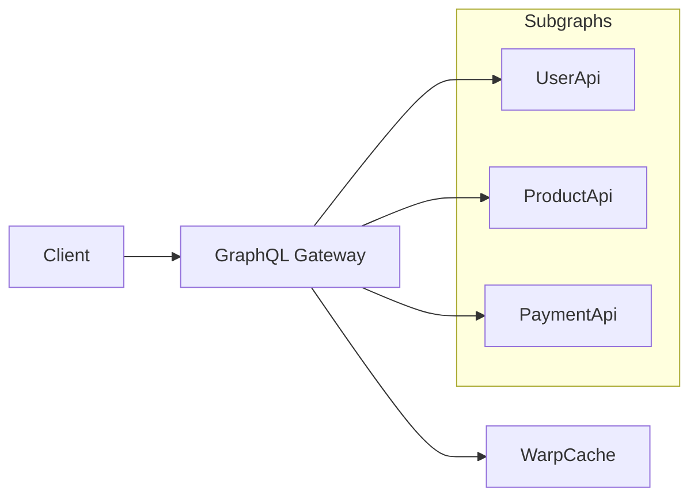

# GraphQL Gateway

The GraphQL Gateway is a federation gateway that composes multiple GraphQL subgraph services into a single unified API. Built using HotChocolate Fusion.

## Overview

The gateway federates three backend services:

| Subgraph | Port (Local) | Purpose |
|----------|--------------|---------|
| UserApi | 5300 | User management, profiles |
| ProductApi | 5200 | Products, pricing, plans |
| PaymentApi | 5400 | Payments, subscriptions |

All queries and mutations go through the gateway at `/graphql`.

## Architecture



## Authentication

The gateway handles token resolution via WarpCache:

1. Client sends `Authorization: Bearer {tokenId}` or `TokenId` cookie
2. Gateway looks up `token:{tokenId}` in WarpCache
3. If found, forwards actual JWT to subgraphs
4. Subgraphs validate JWT independently via Keycloak

This keeps actual tokens server-side and enables token revocation.

## Building

### Local Development

```powershell
cd dotnet/GraphQLGateway/GraphQLGateway
./build-gateway.ps1
dotnet run
```

Gateway runs at `https://localhost:5000/graphql`

### Docker

The Dockerfile handles subgraph composition at build time:

1. Fetches subgraph URLs from GraphMonitor service
2. Exports schemas from each subgraph
3. Packs and composes into `gateway.fgp`
4. Final image runs the composed gateway

```bash
docker build -f dotnet/GraphQLGateway.Dockerfile -t graphql-gateway .
```

## Configuration

```ini
# Distributed cache (for token resolution)
WarpCache__Url=http://warpcache:7777

# Telemetry (optional)
Otlp__Endpoint=http://otel-collector:4317
```

## Features

### Resilience (Polly)

- **Retry**: 3 attempts with exponential backoff
- **Circuit Breaker**: Opens after 3 failures, 10-second recovery

### Observability (OpenTelemetry)

- **Metrics**: ASP.NET Core, Kestrel, HTTP client
- **Traces**: GraphQL operations, resolver execution, downstream calls
- **Logs**: Exported via OTLP

## Dependencies

- **Upstream**: UserApi, ProductApi, PaymentApi running
- **WarpCache**: For JWT token resolution
- **GraphMonitor**: For subgraph URL discovery (build time)

## Subgraph Composition

At build time, schemas are composed using HotChocolate Fusion:

```bash
# Configure subgraph
dotnet fusion subgraph config set name "UserApi" ...

# Export schema
dotnet run --project UserApi -- schema export --output schema.graphql

# Pack subgraph
dotnet fusion subgraph pack -w ./UserApi

# Compose gateway
dotnet fusion compose -p ./gateway -s ./UserApi -s ./ProductApi -s ./PaymentApi
```

The resulting `gateway.fgp` file is loaded at runtime.
