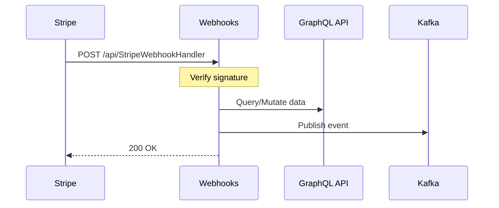

# Webhooks

The Webhooks service handles incoming webhooks from Stripe (payments) and Twilio (SMS), processing external events and synchronizing data with the Nudges system.

## Endpoints

| Endpoint | Method | Purpose |
|----------|--------|---------|
| `/api/StripeWebhookHandler?code={key}` | POST | Stripe webhook events |
| `/api/TwilioWebhookHandler?code={key}` | POST | Incoming SMS from Twilio |

Both endpoints require the `WEBHOOKS_API_KEY` as a query parameter.

## Stripe Webhooks

### Handled Events

| Event | Action |
|-------|--------|
| `checkout.session.completed` | Creates payment confirmation and plan subscription |
| `product.created` | Syncs new Stripe product to Nudges plan |
| `product.updated` | Updates plan name, description, icon, active status |
| `product.deleted` | Deletes corresponding plan |
| `price.created` | Creates price tier from Stripe price |
| `price.updated` | Updates price tier amount |
| `price.deleted` | Deletes price tier |

### Event Flow



### Checkout Flow

When `checkout.session.completed` fires:

1. Retrieves invoice and session details from Stripe
2. Looks up client by Stripe customer ID
3. Creates `PaymentConfirmation` record
4. Creates `PlanSubscription` linking client to plan

## Twilio Webhooks

### SMS Commands

Users can text commands to interact with the system:

| Command | Pattern | Action |
|---------|---------|--------|
| `COMMANDS` or `HELP` | `^commands$` / `^help$` | Returns help text with links |
| `UNSUB <n>` | `UNSUB (\d+)` | Unsubscribe from client by number |
| `CONFIRM` | `^CONFIRM$` | Confirms pending announcement |
| *(any text)* | `.*` | Drafts announcement, prompts for confirm |

### Announcement Flow

1. User (client) texts message content
2. System stores draft in cache: `announcement:{phone}`
3. User texts `CONFIRM`
4. System sends to all subscribers, returns count

### Ignored Messages

These Twilio opt-in keywords are acknowledged but not processed:
- `stop`, `start`, `unstop`, `help`

## Configuration

```ini
# API Security
WEBHOOKS_API_KEY=<api-key>

# Stripe
STRIPE_API_KEY=sk_...
STRIPE_WEBHOOKS_SECRET=whsec_...

# Twilio
TWILIO_ACCOUNT_SID=AC...
TWILIO_AUTH_TOKEN=<token>
TWILIO_MESSAGE_SERVICE_SID=MG...

# Internal Services
GRAPHQL_API_URL=http://graphql-gateway:5443/graphql
LOCALIZATION_API_URL=http://localization-api:5000
AUTH_API_URL=http://auth-api:5555

# Cache & Messaging
REDIS_URL=redis:6379
WarpCache__Url=http://warpcache:7777
Kafka__BrokerList=kafka:9092

# URLs for SMS responses
AccountUrl=https://app.example.com/account
StripePortalUrl=https://billing.stripe.com/p/...
ClientLinkBaseUri=https://app.example.com

# OIDC (for GraphQL auth)
Oidc__ServerUrl=https://keycloak.example.com
Oidc__Realm=nudges
Oidc__ClientId=webhooks
Oidc__ClientSecret=<secret>
```

## Kafka Events Produced

| Topic | Events |
|-------|--------|
| `Payments` | Payment confirmation events |
| `Notifications` | SMS notification events |
| `ForeignProducts` | Stripe product sync events |

## Running

### Local Development

```powershell
cd dotnet/Nudges.Webhooks
dotnet run
```

### Docker

```bash
docker build -f dotnet/Nudges.Webhooks.Dockerfile -t webhooks .
docker run --env-file .env -p 5000:5000 webhooks
```

## Testing Webhooks Locally

Use the Stripe CLI to forward webhooks:

```bash
stripe listen --forward-to localhost:5000/api/StripeWebhookHandler?code=your-key
```

For Twilio, use ngrok or similar to expose your local endpoint.
