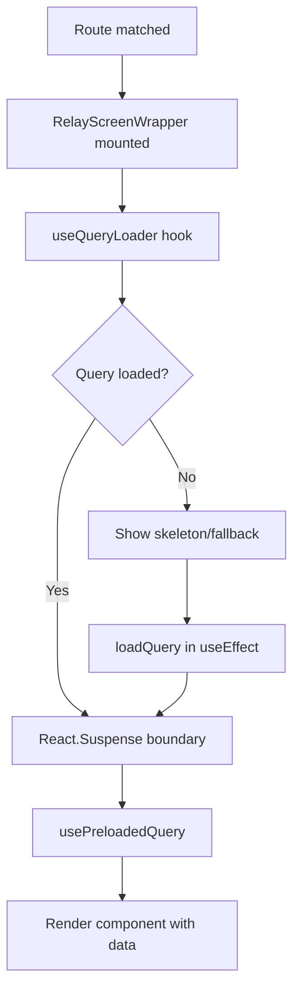
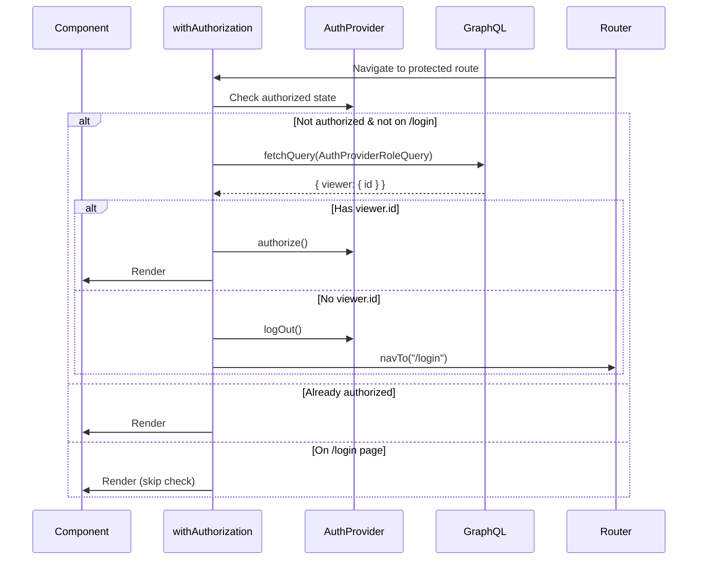
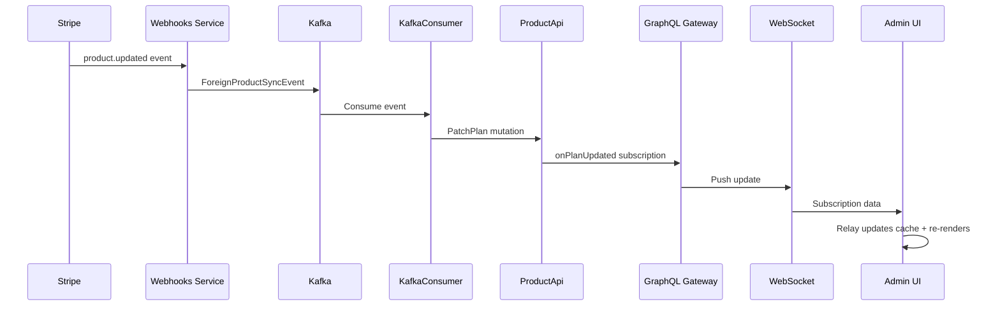

# Architecture

This document details the architectural patterns and design decisions in the new-admin application.

## Table of Contents

- [Overview](#overview)
- [Application Structure](#application-structure)
- [Routing Architecture](#routing-architecture)
- [Relay Integration](#relay-integration)
- [Authentication Flow](#authentication-flow)
- [State Management](#state-management)
- [Real-time Updates](#real-time-updates)

## Overview

The new-admin app is built on a modern React architecture with the following key characteristics:

- **Type-safe GraphQL**: Relay provides compile-time type safety for all GraphQL operations
- **Route-driven data loading**: Each route declares its data requirements via GraphQL queries
- **Real-time subscriptions**: WebSocket-based GraphQL subscriptions for live updates
- **Composable HOCs**: Higher-order components for cross-cutting concerns (auth, Relay)

## Application Structure

### Component Tree

```
<Router>                                    # wouter
  <SnackbarProvider>                       # Toast notifications
    <RelayEnvironmentProviderWrapper>      # Relay + error handling
      <AuthProvider>                       # Auth state
        <Layout>                           # App shell + nav
          <Screens />                      # Route components
        </Layout>
      </AuthProvider>
    </RelayEnvironmentProviderWrapper>
  </SnackbarProvider>
</Router>
```

**Provider responsibilities:**

- `Router` (wouter): Declarative routing, no route config needed
- `SnackbarProvider`: Global toast notification system (custom)
- `RelayEnvironmentProviderWrapper`: Relay environment with GraphQL error handling
- `AuthProvider`: Authentication state and `withAuthorization` HOC
- `Layout`: Application chrome (navigation header, content area)

### Directory Organization

```
src/
├── components/           # Shared UI components
│   ├── ui/              # shadcn/ui primitives (Button, Input, etc.)
│   ├── layout.tsx       # App layout shell
│   ├── NavHeader.tsx    # Navigation header
│   └── ...              # Other shared components
├── Router/              # Routing infrastructure
├── Screens/             # Route-based screens
├── hooks/               # Custom React hooks
├── lib/                 # Utilities
├── AuthProvider.tsx     # Auth context + HOC
├── ErrorBoundary.tsx    # Error boundary component
├── crateRelayEnvironment.ts  # Relay environment factory
└── main.tsx             # Application entry point
```

**Key principles:**

- **Screens are routes**: Each screen maps 1:1 with a route
- **Components are reusable**: Generic UI components live in `components/`
- **Colocation**: Screen-specific logic stays in the screen folder
- **Generated types**: Relay generates TypeScript types in `__generated__/`

## Routing Architecture

### Custom Router Factory Pattern

The app uses a custom router integration (`createRouterFactory`) that bridges wouter with Relay.

**Flow:**

1. Define screen with GraphQL query + component
2. Register in `Screens/index.tsx`
3. `createRouterFactory` creates wouter `<Route>` components
4. `withRelay` HOC wraps each route to handle data loading

**Route definition anatomy** (`route.ts`):

```typescript
import { RouteDefinition } from "@/Router/withRelay";
import Query, { type MyScreenQuery } from "./__generated__/MyScreenQuery.graphql";
import { MyScreenQueryDef } from "./MyScreen";
import { withAuthorization } from "@/AuthProvider";
import React from "react";

export default {
  path: "/my-screen/:id",           // wouter path pattern
  component: withAuthorization(     // HOC wrapping for auth
    React.lazy(() => import("."))   // Code-split component
  ),
  gqlQuery: MyScreenQueryDef,        // GraphQL query definition
  query: Query,                      // Relay-compiled query
  fetchPolicy: 'store-or-network'    // Optional: Relay fetch policy
} satisfies RouteDefinition<MyScreenQuery>;
```

### Query Variable Extraction

`createRouterFactory` automatically extracts query variables from:

1. **URL params**: `/plan/:id` → `{ id: "..." }`
2. **Query string** (if `includeQueryString: true`): `?foo=bar` → `{ foo: "bar" }`

**Implementation** (`createRouterFactory.tsx:13-37`):

- Wouter's `useParams()` hook provides route params
- `queryStringToObject()` parses URLSearchParams
- Both merged into `queryVars` object
- Passed to Relay as query variables

**Example:**

```
URL: /plan/abc123?debug=true
Route pattern: /plan/:id

Result: { id: "abc123", debug: "true" }
```

## Relay Integration

### withRelay HOC

The `withRelay` higher-order component wraps the router to provide Relay data loading.

**Architecture** (`withRelay.tsx:160-184`):

```typescript
withRelay(
  Navigator,      // Router component (from createRouterFactory)
  routes,         // Array of RouteDefinition
  LoadingScreen   // Fallback during loading
)
```

**What it does:**

1. Creates context for loading state
2. Wraps each route component with `RelayScreenWrapper`
3. Provides `useRelayScreenContext()` hook for refresh capability

### RelayScreenWrapper

For each route, `RelayScreenWrapper` handles the Relay data loading lifecycle.

**Flow** (`withRelay.tsx:97-149`):



**Key features:**

- **Lazy loading**: Query only loads when route is visited
- **Suspense integration**: Automatic loading states
- **Automatic cleanup**: `disposeQuery()` on unmount
- **Refresh support**: `refresh()` function forces network fetch

### Relay Environment

Created in `crateRelayEnvironment.ts`:

```typescript
crateRelayEnvironment(onError: (error) => void) => Environment
```

**Configured with:**

- **Fetch**: HTTP POST to `/graphql` endpoint
- **Subscribe**: WebSocket connection via `graphql-ws` client
- **Store**: In-memory normalized cache (RecordSource)
- **Error handling**: Custom `GraphQLApiError` with status codes

**WebSocket setup** (`crateRelayEnvironment.ts:14-18`):

```typescript
const wsClient = createClient({
  url: `${protocol}://${host}/graphql`,
});
```

Auto-detects `ws://` vs `wss://` based on page protocol.

## Authentication Flow

### AuthProvider

Provides authentication state via React Context.

**State:**

```typescript
type AuthContextType = [
  authorized: boolean,
  authorize: () => void,
  logOut: () => void
]
```

**Hooks:**

- `useAuthorized()`: Boolean auth status
- `useAuthorization()`: Full context tuple

### withAuthorization HOC

Protects routes by wrapping components (`AuthProvider.tsx:56-94`).

**Flow:**



**Implementation details:**

- Uses `fetchQuery` (not hook) to avoid Suspense
- Only checks auth on route change
- Gracefully handles GraphQL errors
- Returns `null` during auth check (loading state)

### Login Screen

The Login screen (`Screens/Login/index.tsx`) is minimal:

1. Queries `viewer` field
2. If `viewer.id` exists → redirect to home
3. If no viewer → redirect to `/auth/login?redirectUri=...`

The actual authentication happens in the Auth API (external service).

## State Management

### Global State

The app minimizes global state using:

- **Relay cache**: Primary data store (normalized GraphQL responses)
- **React Context**: Cross-cutting concerns (auth, theme, notifications)
- **URL state**: Route params and query strings

**No Redux/Zustand**: Relay provides sufficient state management for this use case.

### Local State

Component state uses React hooks:

- `useState`: Ephemeral UI state (modals, form inputs)
- `useForm`: Form state via React Hook Form
- `useRelayScreenContext`: Access to query refresh

### Form State

Forms use React Hook Form + Zod validation:

**Pattern:**

```typescript
const schema = z.object({
  name: z.string().min(1),
  price: z.number().positive(),
});

type FormData = z.infer<typeof schema>;

const form = useForm<FormData>({
  resolver: zodResolver(schema),
  defaultValues: { name: '', price: 0 }
});

const onSubmit = (data: FormData) => {
  // data is fully typed and validated
};
```

**Benefits:**

- Type-safe form data
- Declarative validation rules
- Automatic error messages
- Integration with shadcn/ui Form components

## Real-time Updates

### GraphQL Subscriptions

Relay environment supports GraphQL subscriptions over WebSocket.

**Setup** (`crateRelayEnvironment.ts:58-69`):

```typescript
const subscribe: SubscribeFunction = (operation, variables) => {
  return Observable.create((sink) => {
    return wsClient.subscribe(
      {
        operationName: operation.name,
        query: operation.text,
        variables,
      },
      sink
    );
  });
};
```

**Usage in screens:**

Screens can use Relay's `useSubscription` hook to listen for real-time updates:

```typescript
useSubscription({
  subscription: graphql`
    subscription PlanUpdatedSubscription {
      onPlanUpdated {
        id
        name
      }
    }
  `,
  variables: {},
  onNext: (response) => {
    // Update UI with new data
  }
});
```

### Event Flow Example

When a plan is updated via external event (e.g., Stripe webhook):



The UI automatically receives updates without polling.

## Design Decisions

### Why Wouter?

- **Lightweight**: 1.3KB vs 11KB (react-router)
- **Hook-based**: Modern React idioms
- **Simple**: Declarative routes, no complex config
- **Sufficient**: Supports params, navigation, redirects

### Why Relay?

- **Type safety**: Generated TypeScript types from GraphQL
- **Normalized cache**: Automatic de-duplication and updates
- **Subscriptions**: First-class WebSocket support
- **Declarative**: Components declare data needs via fragments
- **Performance**: Only fetches what's needed, automatic batching

### Why Not Use React Router?

The custom router factory (`createRouterFactory` + `withRelay`) provides:

- Automatic query variable extraction from URL
- Tight integration with Relay's preloading
- Simpler than React Router + custom hooks
- Less boilerplate per route

### Why shadcn/ui?

- **Copy-paste components**: No package dependencies
- **Customizable**: Full control over styling
- **Radix primitives**: Accessible, unstyled components
- **Tailwind**: Utility-first styling workflow
- **Type-safe**: TypeScript throughout

## Performance Considerations

### Code Splitting

All screens use `React.lazy()` for automatic code splitting:

```typescript
component: React.lazy(() => import("."))
```

Each screen is a separate chunk loaded on-demand.

### Relay Query Optimization

- **Fragments**: Screens use fragments to declare minimal data needs
- **Fetch policies**: `store-or-network` default (cache-first)
- **Subscription updates**: Relay automatically updates all components using that data

### Build Output

Vite optimizes for production:

- Tree-shaking unused code
- Minification
- CSS extraction and minification
- Chunk splitting for optimal caching

## Error Handling

### GraphQL Errors

**Query errors** are caught by:

1. `crateRelayEnvironment` → calls `onError` callback
2. `RelayEnvironmentProviderWrapper` → shows error dialog or toast
3. React ErrorBoundary → catches render errors

**Current limitation** (`withRelay.tsx:65`): GraphQL `errors` field in response not passed to components. Only network/parse errors are handled.

### Network Errors

Fetch failures trigger:

1. `onFail` callback in `createFetchQuery`
2. Error boundary catches exceptions
3. User sees error dialog

### Component Errors

`ErrorBoundary` wraps each route:

```typescript
<ErrorBoundary>
  <Component queryVars={queryVars} {...props} />
</ErrorBoundary>
```

Catches React errors and shows fallback UI.

## Future Enhancements

Based on TODOs in codebase:

1. **Pass GraphQL errors to components** (`withRelay.tsx:65`)
   - Add `errors` field to `RelayRoute` type
   - Extract from response in `RelayComponentWrapper`

2. **Price tier dialog** (`DiscountCodeForm.tsx:46`)
   - Build dialog component for selecting price tiers
   - Integrate with discount code form

3. **Optimistic updates**
   - Use Relay's optimistic response feature
   - Immediate UI feedback for mutations

4. **Offline support**
   - Persist Relay store to localStorage
   - Queue mutations while offline

5. **Enhanced error recovery**
   - Retry failed queries
   - Exponential backoff for subscriptions
